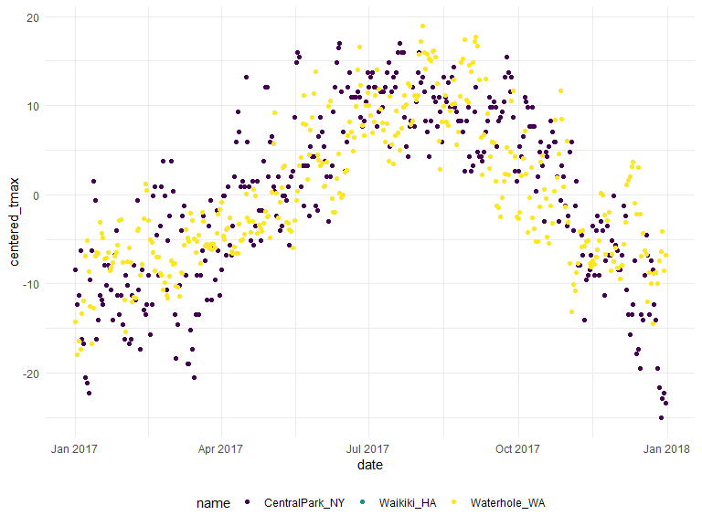

EDA
================
Kristal Quispe
10/7/2019

## Create Weather Data

``` r
weather_df = 
  rnoaa::meteo_pull_monitors(c("USW00094728", "USC00519397", "USS0023B17S"),
                      var = c("PRCP", "TMIN", "TMAX"), 
                      date_min = "2017-01-01",
                      date_max = "2017-12-31") %>%
  mutate(
    name = recode(id, USW00094728 = "CentralPark_NY", 
                      USC00519397 = "Waikiki_HA",
                      USS0023B17S = "Waterhole_WA"),
    tmin = tmin / 10,
    tmax = tmax / 10,
    month = lubridate::floor_date(date, unit = "month")) %>%
  select(name, id, date, month, everything())
```

    ## Registered S3 method overwritten by 'crul':
    ##   method                 from
    ##   as.character.form_file httr

    ## Registered S3 method overwritten by 'hoardr':
    ##   method           from
    ##   print.cache_info httr

    ## file path:          C:\Users\kriqu\AppData\Local\rnoaa\rnoaa\Cache/ghcnd/USW00094728.dly

    ## file last updated:  2019-10-02 16:18:47

    ## file min/max dates: 1869-01-01 / 2019-09-30

    ## file path:          C:\Users\kriqu\AppData\Local\rnoaa\rnoaa\Cache/ghcnd/USC00519397.dly

    ## file last updated:  2019-10-02 16:19:05

    ## file min/max dates: 1965-01-01 / 2019-09-30

    ## file path:          C:\Users\kriqu\AppData\Local\rnoaa\rnoaa\Cache/ghcnd/USS0023B17S.dly

    ## file last updated:  2019-10-02 16:19:13

    ## file min/max dates: 1999-09-01 / 2019-09-30

## Group By and counting

``` r
weather_df %>% 
  group_by(name, month)
```

    ## # A tibble: 1,095 x 7
    ## # Groups:   name, month [36]
    ##    name           id          date       month       prcp  tmax  tmin
    ##    <chr>          <chr>       <date>     <date>     <dbl> <dbl> <dbl>
    ##  1 CentralPark_NY USW00094728 2017-01-01 2017-01-01     0   8.9   4.4
    ##  2 CentralPark_NY USW00094728 2017-01-02 2017-01-01    53   5     2.8
    ##  3 CentralPark_NY USW00094728 2017-01-03 2017-01-01   147   6.1   3.9
    ##  4 CentralPark_NY USW00094728 2017-01-04 2017-01-01     0  11.1   1.1
    ##  5 CentralPark_NY USW00094728 2017-01-05 2017-01-01     0   1.1  -2.7
    ##  6 CentralPark_NY USW00094728 2017-01-06 2017-01-01    13   0.6  -3.8
    ##  7 CentralPark_NY USW00094728 2017-01-07 2017-01-01    81  -3.2  -6.6
    ##  8 CentralPark_NY USW00094728 2017-01-08 2017-01-01     0  -3.8  -8.8
    ##  9 CentralPark_NY USW00094728 2017-01-09 2017-01-01     0  -4.9  -9.9
    ## 10 CentralPark_NY USW00094728 2017-01-10 2017-01-01     0   7.8  -6  
    ## # ... with 1,085 more rows

``` r
weather_df %>% 
  group_by(name) %>% 
  summarize(n_obs = n())
```

    ## # A tibble: 3 x 2
    ##   name           n_obs
    ##   <chr>          <int>
    ## 1 CentralPark_NY   365
    ## 2 Waikiki_HA       365
    ## 3 Waterhole_WA     365

``` r
#n() is for number of rows
```

``` r
#You can also group by two variables

weather_df %>% 
  group_by(name, month) %>% 
  summarize(n_obs = n())
```

    ## # A tibble: 36 x 3
    ## # Groups:   name [3]
    ##    name           month      n_obs
    ##    <chr>          <date>     <int>
    ##  1 CentralPark_NY 2017-01-01    31
    ##  2 CentralPark_NY 2017-02-01    28
    ##  3 CentralPark_NY 2017-03-01    31
    ##  4 CentralPark_NY 2017-04-01    30
    ##  5 CentralPark_NY 2017-05-01    31
    ##  6 CentralPark_NY 2017-06-01    30
    ##  7 CentralPark_NY 2017-07-01    31
    ##  8 CentralPark_NY 2017-08-01    31
    ##  9 CentralPark_NY 2017-09-01    30
    ## 10 CentralPark_NY 2017-10-01    31
    ## # ... with 26 more rows

``` r
#n() is for number of rows
```

``` r
weather_df %>% 
  group_by(month) %>% 
  summarize(
    n_obs = n(),
    n_unique = n_distinct(date))
```

    ## # A tibble: 12 x 3
    ##    month      n_obs n_unique
    ##    <date>     <int>    <int>
    ##  1 2017-01-01    93       31
    ##  2 2017-02-01    84       28
    ##  3 2017-03-01    93       31
    ##  4 2017-04-01    90       30
    ##  5 2017-05-01    93       31
    ##  6 2017-06-01    90       30
    ##  7 2017-07-01    93       31
    ##  8 2017-08-01    93       31
    ##  9 2017-09-01    90       30
    ## 10 2017-10-01    93       31
    ## 11 2017-11-01    90       30
    ## 12 2017-12-01    93       31

other wasys to count things

``` r
weather_df %>% 
  count(name)
```

    ## # A tibble: 3 x 2
    ##   name               n
    ##   <chr>          <int>
    ## 1 CentralPark_NY   365
    ## 2 Waikiki_HA       365
    ## 3 Waterhole_WA     365

``` r
#you can also count by name and month

weather_df %>% 
  count(name, month)
```

    ## # A tibble: 36 x 3
    ##    name           month          n
    ##    <chr>          <date>     <int>
    ##  1 CentralPark_NY 2017-01-01    31
    ##  2 CentralPark_NY 2017-02-01    28
    ##  3 CentralPark_NY 2017-03-01    31
    ##  4 CentralPark_NY 2017-04-01    30
    ##  5 CentralPark_NY 2017-05-01    31
    ##  6 CentralPark_NY 2017-06-01    30
    ##  7 CentralPark_NY 2017-07-01    31
    ##  8 CentralPark_NY 2017-08-01    31
    ##  9 CentralPark_NY 2017-09-01    30
    ## 10 CentralPark_NY 2017-10-01    31
    ## # ... with 26 more rows

``` r
#Base R table function is bad, dont use. table doesn't work on data frames so you have to use pull first. 
weather_df %>% 
  pull(name) %>% 
  table()
```

(lets make a nice table)

``` r
weather_df %>% 
  count(name) %>% 
  knitr::kable()
```

| name            |   n |
| :-------------- | --: |
| CentralPark\_NY | 365 |
| Waikiki\_HA     | 365 |
| Waterhole\_WA   | 365 |

``` r
#kable takes a table and makes it like a knitter table, nice r markdown down table. 
```

## 2X2 tables

a digression…

``` r
weather_df %>% 
  filter(name != "Waikiki_HA") %>% 
  mutate(
    cold = case_when(
      tmax <  5 ~ "cold",
      tmax >= 5 ~ "not cold",
      TRUE      ~"" #anything else that is is true will be blank
    )
  ) %>% 
  group_by(name, cold) %>% 
  count() %>% 
  pivot_wider(
    names_from = cold,
    values_from = n
  )
```

    ## # A tibble: 2 x 3
    ## # Groups:   name, cold [2]
    ##   name            cold `not cold`
    ##   <chr>          <int>      <int>
    ## 1 CentralPark_NY    44        321
    ## 2 Waterhole_WA     172        193

other way to make the 2 by 2 table…

``` r
weather_df %>% 
  filter(name != "Waikiki_HA") %>% 
  mutate(
    cold = case_when(
      tmax <  5 ~ "cold",
      tmax >= 5 ~ "not cold",
      TRUE      ~"" #anything else that is is true will be blank
    )
  ) %>% 
  janitor::tabyl(name,cold)
```

    ##            name cold not cold
    ##  CentralPark_NY   44      321
    ##    Waterhole_WA  172      193

## general summaries

``` r
weather_df %>% 
  group_by(name) %>% 
  summarize(
    n = n(),
    mean_tmax = mean(tmax),
    sd_tmax = sd(tmax),
    median_prcp = median(prcp)
  )
```

    ## # A tibble: 3 x 5
    ##   name               n mean_tmax sd_tmax median_prcp
    ##   <chr>          <int>     <dbl>   <dbl>       <dbl>
    ## 1 CentralPark_NY   365     17.4     9.86           0
    ## 2 Waikiki_HA       365     NA     NaN             NA
    ## 3 Waterhole_WA     365      7.48    7.96           0

``` r
weather_df %>% 
  filter(is.na(tmax))
```

    ## # A tibble: 3 x 7
    ##   name       id          date       month       prcp  tmax  tmin
    ##   <chr>      <chr>       <date>     <date>     <dbl> <dbl> <dbl>
    ## 1 Waikiki_HA USC00519397 2017-05-09 2017-05-01    NA    NA    NA
    ## 2 Waikiki_HA USC00519397 2017-05-26 2017-05-01    NA    NA    NA
    ## 3 Waikiki_HA USC00519397 2017-07-19 2017-07-01    NA    NA    NA

``` r
#3 rows in the waikiki data set has NA values. By default anytime you comupte a mean, median or sd of a vairable that has NA, R will return NA, b/c we cant take the mean/median/sd of a value that doesnt exist. 

#Options to avoid this is to drop the rows with NA values
```

\#Options to avoid this is to drop the rows with NA values. Can use
drop.na or do code below (na.rm =TRUE)

``` r
weather_df %>% 
  group_by(name) %>% 
  summarize(
    n = n(),
    mean_tmax = mean(tmax, na.rm = TRUE),
    sd_tmax = sd(tmax, na.rm = TRUE),
    median_prcp = median(prcp, na.rm = TRUE)
  )
```

    ## # A tibble: 3 x 5
    ##   name               n mean_tmax sd_tmax median_prcp
    ##   <chr>          <int>     <dbl>   <dbl>       <dbl>
    ## 1 CentralPark_NY   365     17.4     9.86           0
    ## 2 Waikiki_HA       365     29.7     2.15           0
    ## 3 Waterhole_WA     365      7.48    7.96           0

for grouping by more than one variable

``` r
weather_df %>% 
  group_by(name, month) %>% 
  summarize(
    n = n(),
    mean_tmax = mean(tmax, na.rm = TRUE),
    sd_tmax = sd(tmax, na.rm = TRUE),
    median_prcp = median(prcp, na.rm = TRUE)
  )
```

make a plot where x avis is month and y month axis is mean t max

``` r
weather_df %>% 
  group_by(name, month) %>% 
  summarize(
    n = n(),
    mean_tmax = mean(tmax, na.rm = TRUE),
    sd_tmax = sd(tmax, na.rm = TRUE),
    median_prcp = median(prcp, na.rm = TRUE)
  ) %>% 
  ggplot(aes(x = month, y = mean_tmax, color = name))+
  geom_point() + geom_line()
```


``` r
weather_df %>% 
  group_by(name, month) %>% 
  summarize(
    mean_tmax = mean(tmax, na.rm = TRUE)
  ) %>% 
  pivot_wider(
    names_from = name,
    values_from = mean_tmax
  ) %>% 
  knitr::kable(digits = 1)
```

| month      | CentralPark\_NY | Waikiki\_HA | Waterhole\_WA |
| :--------- | --------------: | ----------: | ------------: |
| 2017-01-01 |             6.0 |        27.8 |         \-1.4 |
| 2017-02-01 |             9.3 |        27.2 |           0.0 |
| 2017-03-01 |             8.2 |        29.1 |           1.7 |
| 2017-04-01 |            18.3 |        29.7 |           3.9 |
| 2017-05-01 |            20.1 |        30.1 |          10.1 |
| 2017-06-01 |            26.3 |        31.3 |          12.9 |
| 2017-07-01 |            28.7 |        31.8 |          16.3 |
| 2017-08-01 |            27.2 |        32.0 |          19.6 |
| 2017-09-01 |            25.4 |        31.7 |          14.2 |
| 2017-10-01 |            21.8 |        30.3 |           8.3 |
| 2017-11-01 |            12.3 |        28.4 |           1.4 |
| 2017-12-01 |             4.5 |        26.5 |           2.2 |

## Grouped mutate

dont forget you can ungroup

``` r
weather_df %>% 
  group_by(name) %>% 
  ungroup()
```

    ## # A tibble: 1,095 x 7
    ##    name           id          date       month       prcp  tmax  tmin
    ##    <chr>          <chr>       <date>     <date>     <dbl> <dbl> <dbl>
    ##  1 CentralPark_NY USW00094728 2017-01-01 2017-01-01     0   8.9   4.4
    ##  2 CentralPark_NY USW00094728 2017-01-02 2017-01-01    53   5     2.8
    ##  3 CentralPark_NY USW00094728 2017-01-03 2017-01-01   147   6.1   3.9
    ##  4 CentralPark_NY USW00094728 2017-01-04 2017-01-01     0  11.1   1.1
    ##  5 CentralPark_NY USW00094728 2017-01-05 2017-01-01     0   1.1  -2.7
    ##  6 CentralPark_NY USW00094728 2017-01-06 2017-01-01    13   0.6  -3.8
    ##  7 CentralPark_NY USW00094728 2017-01-07 2017-01-01    81  -3.2  -6.6
    ##  8 CentralPark_NY USW00094728 2017-01-08 2017-01-01     0  -3.8  -8.8
    ##  9 CentralPark_NY USW00094728 2017-01-09 2017-01-01     0  -4.9  -9.9
    ## 10 CentralPark_NY USW00094728 2017-01-10 2017-01-01     0   7.8  -6  
    ## # ... with 1,085 more rows

``` r
#when you use group by and sumarize you get a new data frame with the number of rows equals the number of group, and the columns are the things we are summarizing by

#since mutate happen after the group by statement, the mutate will be group specific.

weather_df %>% 
  group_by(name) %>% 
  mutate(
    mean_tmax = mean(tmax, na.rn = TRUE),
    centered_tmax = tmax - mean_tmax) %>% 
  ggplot(aes(x = date, y = centered_tmax, color = name)) + 
    geom_point() 
```



window function un grouped mutates…

``` r
weather_df %>%
  group_by(name, month) %>%
  mutate(temp_ranking = min_rank(tmax)) %>% 
  filter(temp_ranking == 1)
```

    ## # A tibble: 42 x 8
    ## # Groups:   name, month [36]
    ##    name       id       date       month       prcp  tmax  tmin temp_ranking
    ##    <chr>      <chr>    <date>     <date>     <dbl> <dbl> <dbl>        <int>
    ##  1 CentralPa~ USW0009~ 2017-01-09 2017-01-01     0  -4.9  -9.9            1
    ##  2 CentralPa~ USW0009~ 2017-02-10 2017-02-01     0   0    -7.1            1
    ##  3 CentralPa~ USW0009~ 2017-03-15 2017-03-01     0  -3.2  -6.6            1
    ##  4 CentralPa~ USW0009~ 2017-04-01 2017-04-01     0   8.9   2.8            1
    ##  5 CentralPa~ USW0009~ 2017-05-13 2017-05-01   409  11.7   7.2            1
    ##  6 CentralPa~ USW0009~ 2017-06-06 2017-06-01    15  14.4  11.1            1
    ##  7 CentralPa~ USW0009~ 2017-07-25 2017-07-01     0  21.7  16.7            1
    ##  8 CentralPa~ USW0009~ 2017-08-29 2017-08-01    74  20    16.1            1
    ##  9 CentralPa~ USW0009~ 2017-09-30 2017-09-01     0  18.9  12.2            1
    ## 10 CentralPa~ USW0009~ 2017-10-31 2017-10-01     0  13.9   7.2            1
    ## # ... with 32 more rows

``` r
weather_df %>%
  group_by(name, month) %>%
  filter(min_rank(tmax) < 2)
```

    ## # A tibble: 42 x 7
    ## # Groups:   name, month [36]
    ##    name           id          date       month       prcp  tmax  tmin
    ##    <chr>          <chr>       <date>     <date>     <dbl> <dbl> <dbl>
    ##  1 CentralPark_NY USW00094728 2017-01-09 2017-01-01     0  -4.9  -9.9
    ##  2 CentralPark_NY USW00094728 2017-02-10 2017-02-01     0   0    -7.1
    ##  3 CentralPark_NY USW00094728 2017-03-15 2017-03-01     0  -3.2  -6.6
    ##  4 CentralPark_NY USW00094728 2017-04-01 2017-04-01     0   8.9   2.8
    ##  5 CentralPark_NY USW00094728 2017-05-13 2017-05-01   409  11.7   7.2
    ##  6 CentralPark_NY USW00094728 2017-06-06 2017-06-01    15  14.4  11.1
    ##  7 CentralPark_NY USW00094728 2017-07-25 2017-07-01     0  21.7  16.7
    ##  8 CentralPark_NY USW00094728 2017-08-29 2017-08-01    74  20    16.1
    ##  9 CentralPark_NY USW00094728 2017-09-30 2017-09-01     0  18.9  12.2
    ## 10 CentralPark_NY USW00094728 2017-10-31 2017-10-01     0  13.9   7.2
    ## # ... with 32 more rows

``` r
weather_df %>%
  group_by(name, month) %>%
  filter(min_rank(desc(tmax)) < 4)
```

    ## # A tibble: 149 x 7
    ## # Groups:   name, month [36]
    ##    name           id          date       month       prcp  tmax  tmin
    ##    <chr>          <chr>       <date>     <date>     <dbl> <dbl> <dbl>
    ##  1 CentralPark_NY USW00094728 2017-01-12 2017-01-01    13  18.9   8.3
    ##  2 CentralPark_NY USW00094728 2017-01-13 2017-01-01     0  16.7   0  
    ##  3 CentralPark_NY USW00094728 2017-01-26 2017-01-01     5  13.3   6.1
    ##  4 CentralPark_NY USW00094728 2017-02-19 2017-02-01     0  18.3  11.7
    ##  5 CentralPark_NY USW00094728 2017-02-23 2017-02-01     0  18.3   6.7
    ##  6 CentralPark_NY USW00094728 2017-02-24 2017-02-01     0  21.1  14.4
    ##  7 CentralPark_NY USW00094728 2017-03-01 2017-03-01    30  21.1  12.2
    ##  8 CentralPark_NY USW00094728 2017-03-02 2017-03-01     0  17.8   1.7
    ##  9 CentralPark_NY USW00094728 2017-03-25 2017-03-01     3  16.7   5.6
    ## 10 CentralPark_NY USW00094728 2017-04-16 2017-04-01     0  30.6  15  
    ## # ... with 139 more rows

lags and
leads…

``` r
#here we are asking how much the tmax variable changed from one day to another. what was that difference, was it large or small. geared towards answersing which dataset has biggest variarblity

weather_df %>%
  group_by(name) %>%
  mutate(
    lagged_tmax = lag(tmax),
    one_day_change = tmax -lagged_tmax) %>% 
  summarize(sd_daily_change = sd(one_day_change, na.rm = TRUE))
```

    ## # A tibble: 3 x 2
    ##   name           sd_daily_change
    ##   <chr>                    <dbl>
    ## 1 CentralPark_NY            4.45
    ## 2 Waikiki_HA                1.23
    ## 3 Waterhole_WA              3.13

``` r
#CENTRAL PARK HAS THE MOST VARIABLITY IN DAILY TEMPERTURE


weather_df %>%
  group_by(name) %>%
  mutate(temp_change = tmax - lag(tmax)) %>%
  summarize(temp_change_sd = sd(temp_change, na.rm = TRUE),
            temp_change_max = max(temp_change, na.rm = TRUE))
```

    ## # A tibble: 3 x 3
    ##   name           temp_change_sd temp_change_max
    ##   <chr>                   <dbl>           <dbl>
    ## 1 CentralPark_NY           4.45            12.7
    ## 2 Waikiki_HA               1.23             6.7
    ## 3 Waterhole_WA             3.13             8
