Visualization I
================
Kristal Quispe
10/2/2019

``` r
knitr::opts_chunk$set(echo = TRUE)

library(tidyverse)
```

    ## -- Attaching packages --------------

    ## v ggplot2 3.2.1     v purrr   0.3.2
    ## v tibble  2.1.3     v dplyr   0.8.3
    ## v tidyr   1.0.0     v stringr 1.4.0
    ## v readr   1.3.1     v forcats 0.4.0

    ## -- Conflicts -----------------------
    ## x dplyr::filter() masks stats::filter()
    ## x dplyr::lag()    masks stats::lag()

``` r
library(ggridges)
```

    ## 
    ## Attaching package: 'ggridges'

    ## The following object is masked from 'package:ggplot2':
    ## 
    ##     scale_discrete_manual

## Create Weather Data

``` r
weather_df = 
  rnoaa::meteo_pull_monitors(c("USW00094728", "USC00519397", "USS0023B17S"),
                      var = c("PRCP", "TMIN", "TMAX"), 
                      date_min = "2017-01-01",
                      date_max = "2017-12-31") %>%
  mutate(
    name = recode(id, USW00094728 = "CentralPark_NY", 
                      USC00519397 = "Waikiki_HA",
                      USS0023B17S = "Waterhole_WA"),
    tmin = tmin / 10,
    tmax = tmax / 10) %>%
  select(name, id, everything())
```

    ## Registered S3 method overwritten by 'crul':
    ##   method                 from
    ##   as.character.form_file httr

    ## Registered S3 method overwritten by 'hoardr':
    ##   method           from
    ##   print.cache_info httr

    ## file path:          C:\Users\kriqu\AppData\Local\rnoaa\rnoaa\Cache/ghcnd/USW00094728.dly

    ## file last updated:  2019-10-02 16:18:47

    ## file min/max dates: 1869-01-01 / 2019-09-30

    ## file path:          C:\Users\kriqu\AppData\Local\rnoaa\rnoaa\Cache/ghcnd/USC00519397.dly

    ## file last updated:  2019-10-02 16:19:05

    ## file min/max dates: 1965-01-01 / 2019-09-30

    ## file path:          C:\Users\kriqu\AppData\Local\rnoaa\rnoaa\Cache/ghcnd/USS0023B17S.dly

    ## file last updated:  2019-10-02 16:19:13

    ## file min/max dates: 1999-09-01 / 2019-09-30

## create a ggplot

``` r
ggplot(weather_df, aes(x= tmin, y=tmax)) +
 geom_point()
```

    ## Warning: Removed 15 rows containing missing values (geom_point).

<!-- -->

## alternate way of making plot above

``` r
weather_df %>% 
  ggplot(aes(x =tmin, y = tmax)) +
  geom_point()
```

    ## Warning: Removed 15 rows containing missing values (geom_point).

<!-- -->

saving initial plots… mostly teacher doesnt do this

``` r
scatterplot = 
  weather_df %>% 
  ggplot(aes(x = tmin, y= tmax)) +
  geom_point()

scatterplot
```

    ## Warning: Removed 15 rows containing missing values (geom_point).

<!-- -->

adding color…

``` r
weather_df %>% 
  ggplot(aes(x =tmin, y = tmax)) +
  geom_point(aes(color = name))
```

    ## Warning: Removed 15 rows containing missing values (geom_point).

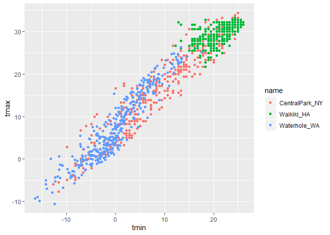<!-- -->

``` r
weather_df %>% 
  ggplot(aes(x =tmin, y = tmax)) +
  geom_point(aes(color = name), alpha = .4)
```

    ## Warning: Removed 15 rows containing missing values (geom_point).

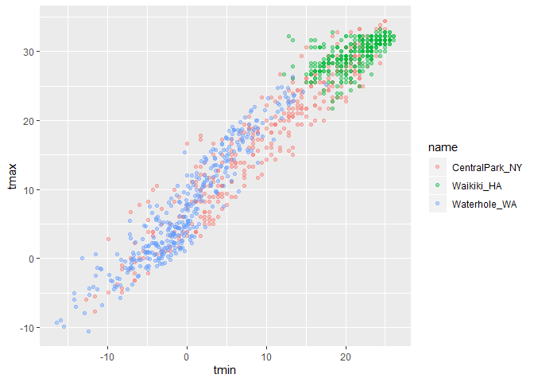<!-- -->

``` r
##alpha code makes the color dot transparent between 0-1
```

why do aesthetic positions matter?

first

``` r
weather_df %>% 
  ggplot(aes(x =tmin, y = tmax)) +
  geom_point(aes(color = name), alpha = .4)+
  geom_smooth(se = FALSE)
```

    ## `geom_smooth()` using method = 'gam' and formula 'y ~ s(x, bs = "cs")'

    ## Warning: Removed 15 rows containing non-finite values (stat_smooth).

    ## Warning: Removed 15 rows containing missing values (geom_point).

<!-- -->

vs.

``` r
weather_df %>% 
  ggplot(aes(x =tmin, y = tmax, color = name)) +
  geom_point(alpha = .4) +
  geom_smooth(se = FALSE)
```

    ## `geom_smooth()` using method = 'loess' and formula 'y ~ x'

    ## Warning: Removed 15 rows containing non-finite values (stat_smooth).

    ## Warning: Removed 15 rows containing missing values (geom_point).

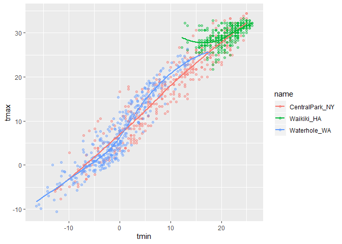<!-- -->

make the one graph into three graphs for each weather station

``` r
weather_df %>% 
  ggplot(aes(x =tmin, y = tmax, color = name)) +
  geom_point(alpha = .4) +
  geom_smooth(se = FALSE) + #se = false is to get rid of CI
  facet_grid(~name) #says that names wil be in the columns, ~ is a tilda
```

    ## `geom_smooth()` using method = 'loess' and formula 'y ~ x'

    ## Warning: Removed 15 rows containing non-finite values (stat_smooth).

    ## Warning: Removed 15 rows containing missing values (geom_point).

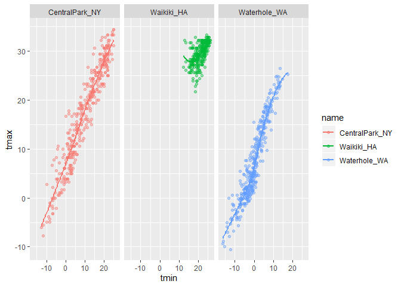<!-- -->

this is fine, but not interesting

``` r
weather_df %>% 
  ggplot(aes(x = date, y = tmax, color = name)) +
  geom_point() +
  geom_smooth(se = FALSE)
```

    ## `geom_smooth()` using method = 'loess' and formula 'y ~ x'

    ## Warning: Removed 3 rows containing non-finite values (stat_smooth).

    ## Warning: Removed 3 rows containing missing values (geom_point).

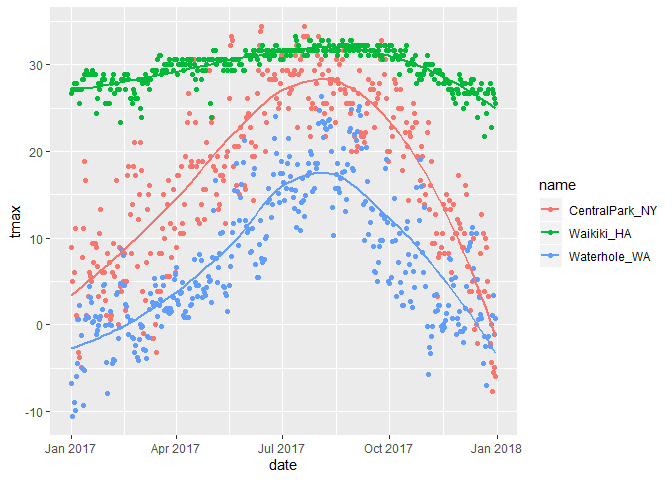<!-- -->

``` r
#to make the data points proportional to size of precip and to make the smooth line bigger
weather_df %>% 
  ggplot(aes(x = date, y = tmax, color = name)) +
  geom_point(aes(size = prcp), alpha =.35) +
  geom_smooth(size = 2, se = FALSE)
```

    ## `geom_smooth()` using method = 'loess' and formula 'y ~ x'

    ## Warning: Removed 3 rows containing non-finite values (stat_smooth).
    
    ## Warning: Removed 3 rows containing missing values (geom_point).

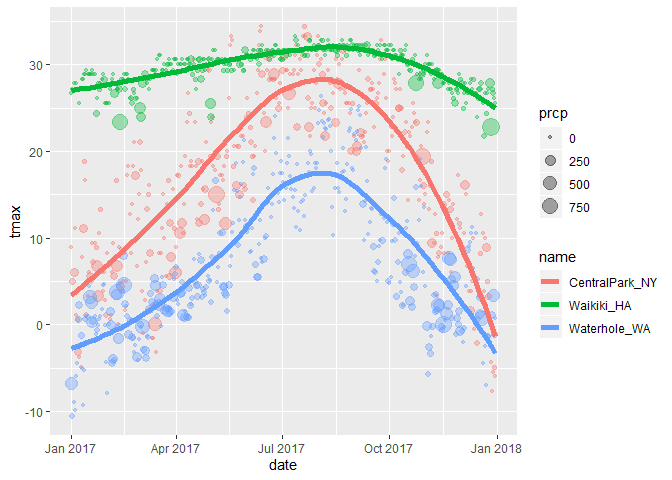<!-- -->

``` r
weather_df %>% 
  ggplot(aes(x = date, y = prcp, color = name)) +
  geom_point() +
  geom_smooth(se = FALSE)
```

    ## `geom_smooth()` using method = 'loess' and formula 'y ~ x'

    ## Warning: Removed 3 rows containing non-finite values (stat_smooth).
    
    ## Warning: Removed 3 rows containing missing values (geom_point).

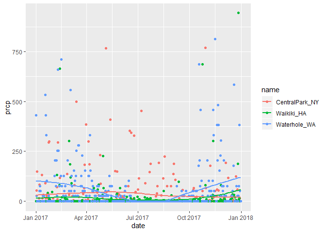<!-- -->

## Some extra stuff

``` r
weather_df %>% 
  ggplot(aes(x = date, y = tmax, color = name)) +
  geom_smooth(size = 2, se = FALSE)
```

    ## `geom_smooth()` using method = 'loess' and formula 'y ~ x'

    ## Warning: Removed 3 rows containing non-finite values (stat_smooth).

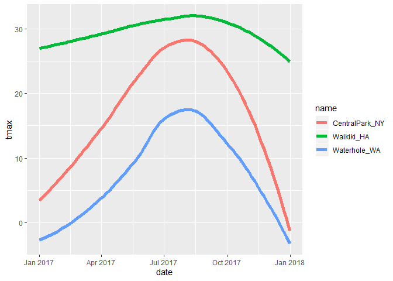<!-- -->

``` r
## you just get smooth line with out data points if you exclude the geopoint. 
```

2d density

``` r
# install.packages("hexbin")
weather_df %>% 
  ggplot(aes(x = tmin, y = tmax)) +
  geom_bin2d() # or geom_hex()
```

    ## Warning: Removed 15 rows containing non-finite values (stat_bin2d).

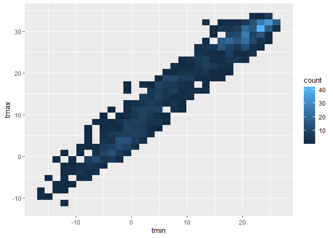<!-- -->

## More kinds of plots\!\!

``` r
weather_df %>% 
  ggplot(aes(x = tmax, color = name)) +
  geom_histogram()
```

    ## `stat_bin()` using `bins = 30`. Pick better value with `binwidth`.

    ## Warning: Removed 3 rows containing non-finite values (stat_bin).

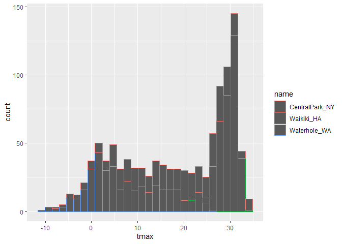<!-- -->

``` r
#color is telling you about what is outside of the bars, fill if for inside

weather_df %>% 
  ggplot(aes(x = tmax, fill = name)) +
  geom_histogram()
```

    ## `stat_bin()` using `bins = 30`. Pick better value with `binwidth`.

    ## Warning: Removed 3 rows containing non-finite values (stat_bin).

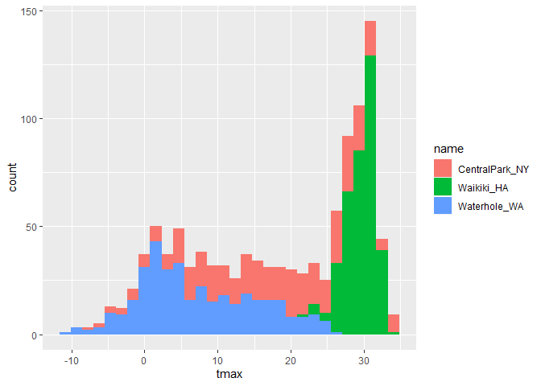<!-- -->

``` r
#if you dont like stacked histograms you can do the following 

weather_df %>% 
  ggplot(aes(x = tmax, fill = name)) +
  geom_histogram(position = "dodge")
```

    ## `stat_bin()` using `bins = 30`. Pick better value with `binwidth`.

    ## Warning: Removed 3 rows containing non-finite values (stat_bin).

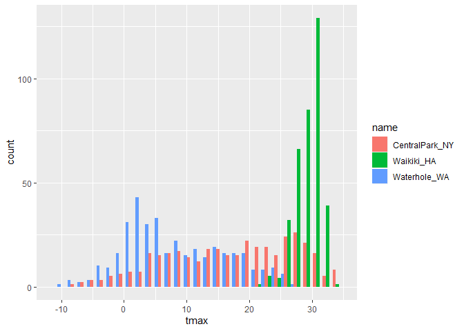<!-- -->

``` r
#to make three seperate histograms
weather_df %>% 
  ggplot(aes(x = tmax, fill = name)) +
  geom_histogram() +
  facet_grid(~name)
```

    ## `stat_bin()` using `bins = 30`. Pick better value with `binwidth`.

    ## Warning: Removed 3 rows containing non-finite values (stat_bin).

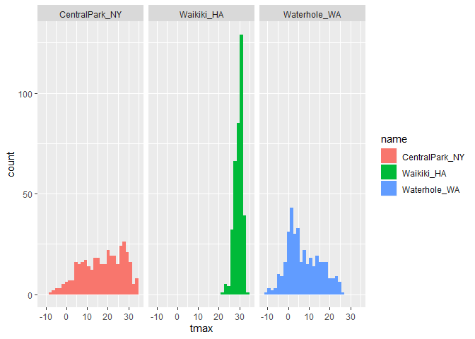<!-- -->

density plots\!\!\!

``` r
weather_df %>% 
  ggplot(aes(x = tmax, fill = name)) +
  geom_density(alpha = .3)
```

    ## Warning: Removed 3 rows containing non-finite values (stat_density).

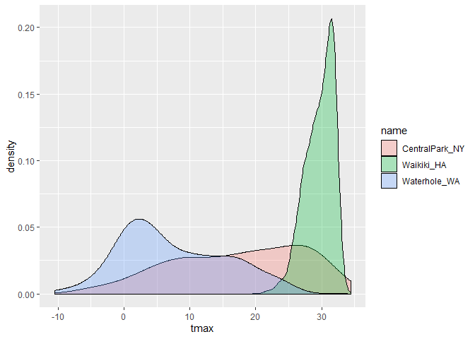<!-- -->

univariate plots\!\!

``` r
weather_df %>% 
  ggplot(aes(x = name, y = tmax)) +
  geom_boxplot()
```

    ## Warning: Removed 3 rows containing non-finite values (stat_boxplot).

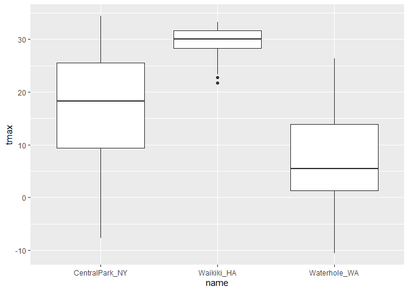<!-- -->

violin plot\!\!

``` r
weather_df %>% 
  ggplot(aes(x = name, y = tmax)) +
  geom_violin()
```

    ## Warning: Removed 3 rows containing non-finite values (stat_ydensity).

<!-- -->

ridge plots\!\!\!

good for bimodal and multi group comparisons

``` r
weather_df %>% 
  ggplot(aes(x = tmax, y = name)) +
  geom_density_ridges()
```

    ## Picking joint bandwidth of 1.84

    ## Warning: Removed 3 rows containing non-finite values (stat_density_ridges).

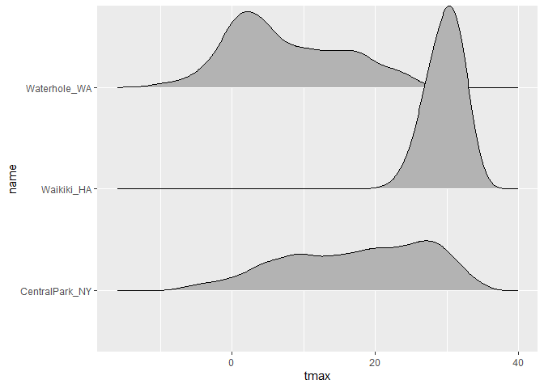<!-- -->

\#\#saving a plot

``` r
ggp_rideg_temp =
  weather_df %>% 
  ggplot(aes(x = tmax, y = name)) +
  geom_density_ridges()

ggsave("ggplot_temp_ridge.pdf", ggp_rideg_temp)
```

    ## Saving 7 x 5 in image

    ## Picking joint bandwidth of 1.84

    ## Warning: Removed 3 rows containing non-finite values (stat_density_ridges).

embedding plots in R markdown

``` r
weather_df %>% 
  ggplot(aes(x =tmin, y = tmax, color = name)) +
  geom_point(alpha = .4) +
  geom_smooth(se = FALSE)
```

    ## `geom_smooth()` using method = 'loess' and formula 'y ~ x'

    ## Warning: Removed 15 rows containing non-finite values (stat_smooth).

    ## Warning: Removed 15 rows containing missing values (geom_point).

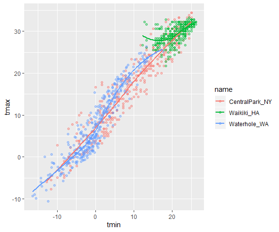<!-- -->

``` r
weather_df %>% 
  ggplot(aes(x =tmin, y = tmax, color = name)) +
  geom_point(alpha = .4) +
  geom_smooth(se = FALSE)
```

    ## `geom_smooth()` using method = 'loess' and formula 'y ~ x'

    ## Warning: Removed 15 rows containing non-finite values (stat_smooth).

    ## Warning: Removed 15 rows containing missing values (geom_point).

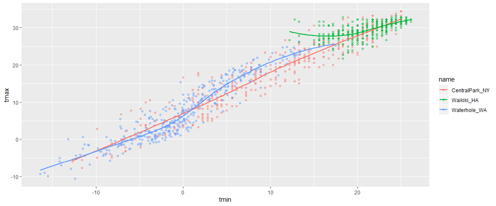<!-- -->
