Visualization II
================
Kristal Quispe
10/3/2019

``` r
knitr::opts_chunk$set(echo = TRUE)
#Code above is for general preferences of all plots going forward. 
library(tidyverse)
```

    ## -- Attaching packages -------------------------------- tidyverse 1.2.1 --

    ## v ggplot2 3.2.1     v purrr   0.3.2
    ## v tibble  2.1.3     v dplyr   0.8.3
    ## v tidyr   1.0.0     v stringr 1.4.0
    ## v readr   1.3.1     v forcats 0.4.0

    ## -- Conflicts ----------------------------------- tidyverse_conflicts() --
    ## x dplyr::filter() masks stats::filter()
    ## x dplyr::lag()    masks stats::lag()

``` r
library(ggridges)
```

    ## 
    ## Attaching package: 'ggridges'

    ## The following object is masked from 'package:ggplot2':
    ## 
    ##     scale_discrete_manual

``` r
library(patchwork)
```

## Create Weather Data

``` r
weather_df = 
  rnoaa::meteo_pull_monitors(c("USW00094728", "USC00519397", "USS0023B17S"),
                      var = c("PRCP", "TMIN", "TMAX"), 
                      date_min = "2017-01-01",
                      date_max = "2017-12-31") %>%
  mutate(
    name = recode(id, USW00094728 = "CentralPark_NY", 
                      USC00519397 = "Waikiki_HA",
                      USS0023B17S = "Waterhole_WA"),
    tmin = tmin / 10,
    tmax = tmax / 10) %>%
  select(name, id, everything())
```

    ## Registered S3 method overwritten by 'crul':
    ##   method                 from
    ##   as.character.form_file httr

    ## Registered S3 method overwritten by 'hoardr':
    ##   method           from
    ##   print.cache_info httr

    ## file path:          C:\Users\kriqu\AppData\Local\rnoaa\rnoaa\Cache/ghcnd/USW00094728.dly

    ## file last updated:  2019-10-02 16:18:47

    ## file min/max dates: 1869-01-01 / 2019-09-30

    ## file path:          C:\Users\kriqu\AppData\Local\rnoaa\rnoaa\Cache/ghcnd/USC00519397.dly

    ## file last updated:  2019-10-02 16:19:05

    ## file min/max dates: 1965-01-01 / 2019-09-30

    ## file path:          C:\Users\kriqu\AppData\Local\rnoaa\rnoaa\Cache/ghcnd/USS0023B17S.dly

    ## file last updated:  2019-10-02 16:19:13

    ## file min/max dates: 1999-09-01 / 2019-09-30

## Making new plots

start with an old one

``` r
weather_df %>% 
  ggplot(aes(x = tmin, y = tmax, color = name)) +
  geom_point(alpha =.5)
```

    ## Warning: Removed 15 rows containing missing values (geom_point).

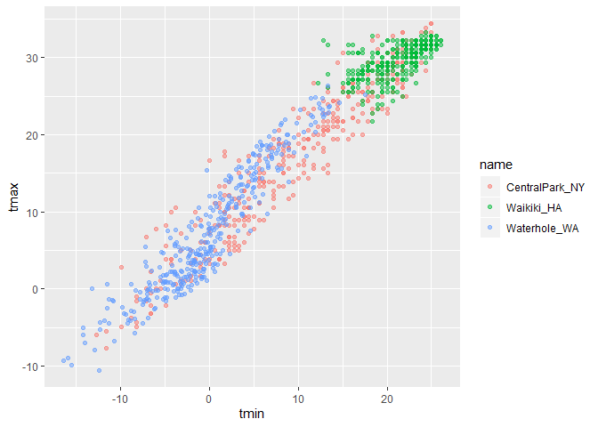<!-- -->

So now we are going to add labels:

``` r
weather_df %>% 
  ggplot(aes(x = tmin, y = tmax, color = name)) +
  geom_point(alpha =.5) +
  labs(
    title = "Temperture plot",
    x = "Minimum Temp (C)",
    y = "Maximum Temp (C)",
    caption = "Data from NOAA via rnoaa package"
  )
```

    ## Warning: Removed 15 rows containing missing values (geom_point).

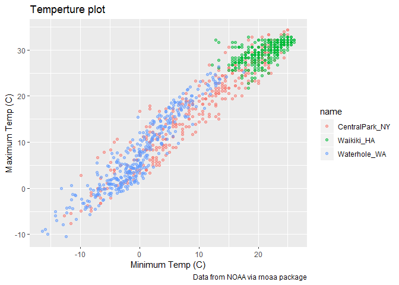<!-- -->

lets play around with scales: x axis tick marks etc

``` r
weather_df %>% 
  ggplot(aes(x = tmin, y = tmax, color = name)) +
  geom_point(alpha =.5) +
  labs(
    title = "Temperture plot",
    x = "Minimum Temp (C)",
    y = "Maximum Temp (C)",
    caption = "Data from NOAA via rnoaa package"
  ) +
  scale_x_continuous(
    breaks = c(-15, -5, 20),
    labels = c("-15C","-5C", "20C" )
  )
```

    ## Warning: Removed 15 rows containing missing values (geom_point).

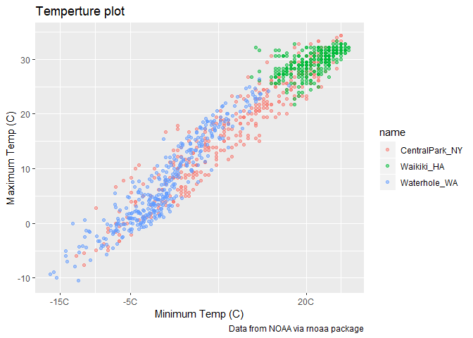<!-- -->

If you need a log or square root transfromation

``` r
weather_df %>% 
  ggplot(aes(x = tmin, y = tmax, color = name)) +
  geom_point(alpha =.5) +
  labs(
    title = "Temperture plot",
    x = "Minimum Temp (C)",
    y = "Maximum Temp (C)",
    caption = "Data from NOAA via rnoaa package"
  ) +
  scale_x_continuous(
    breaks = c(-15, -5, 20),
    labels = c("-15C","-5C", "20C" )
  ) +
  scale_y_continuous(
    trans ="sqrt"
  )
```

    ## Warning in self$trans$transform(x): NaNs produced

    ## Warning: Transformation introduced infinite values in continuous y-axis

    ## Warning: Removed 90 rows containing missing values (geom_point).

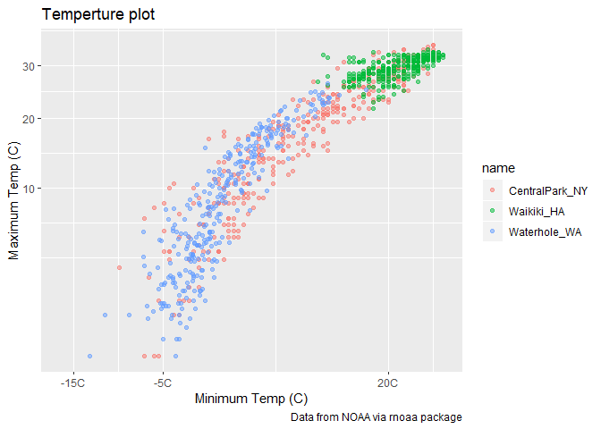<!-- -->

``` r
#or you can do...
weather_df %>% 
  ggplot(aes(x = tmin, y = tmax, color = name)) +
  geom_point(alpha =.5) +
  labs(
    title = "Temperture plot",
    x = "Minimum Temp (C)",
    y = "Maximum Temp (C)",
    caption = "Data from NOAA via rnoaa package"
  ) +
  scale_x_continuous(
    breaks = c(-15, -5, 20),
    labels = c("-15C","-5C", "20C" )
  ) +
  scale_y_sqrt()
```

    ## Warning in self$trans$transform(x): NaNs produced

    ## Warning: Transformation introduced infinite values in continuous y-axis

    ## Warning: Removed 90 rows containing missing values (geom_point).

<!-- -->

## Colors next

``` r
## to change the default colors ggplot sets use a scale color function...
weather_df %>% 
  ggplot(aes(x = tmin, y = tmax, color = name)) +
  geom_point(alpha =.5) +
  labs(
    title = "Temperture plot",
    x = "Minimum Temp (C)",
    y = "Maximum Temp (C)",
    caption = "Data from NOAA via rnoaa package"
  ) +
  scale_color_hue(
    name = "Location",
    h = c(50, 250)
    #name is the key legend name, not the variable name
  )
```

    ## Warning: Removed 15 rows containing missing values (geom_point).

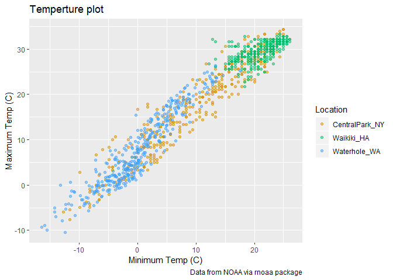<!-- -->

viridis package… gives us more color options

``` r
ggp_base =
weather_df %>% 
  ggplot(aes(x = tmin, y = tmax, color = name)) +
  geom_point(alpha =.5) +
  labs(
    title = "Temperture plot",
    x = "Minimum Temp (C)",
    y = "Maximum Temp (C)",
    caption = "Data from NOAA via rnoaa package"
  ) +
  viridis::scale_color_viridis(
    name = "Location", 
    discrete = TRUE ##variable here is a discrete variable, need to specify this. 
  )

ggp_base
```

    ## Warning: Removed 15 rows containing missing values (geom_point).

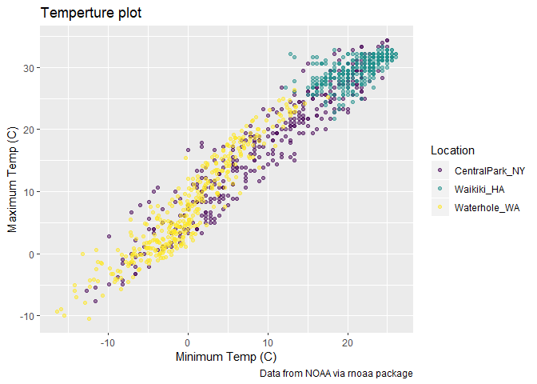<!-- -->

## themes

``` r
## theme has to do with general organization functions, here i am moving legend to the bottom
ggp_base +
  theme(legend.position = "bottom")
```

    ## Warning: Removed 15 rows containing missing values (geom_point).

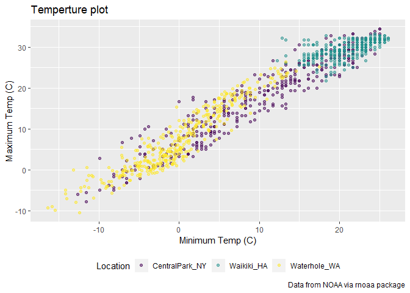<!-- -->

``` r
#If you want a black and white back drop
ggp_base +
  theme_bw() +
  theme(legend.position = "bottom")
```

    ## Warning: Removed 15 rows containing missing values (geom_point).

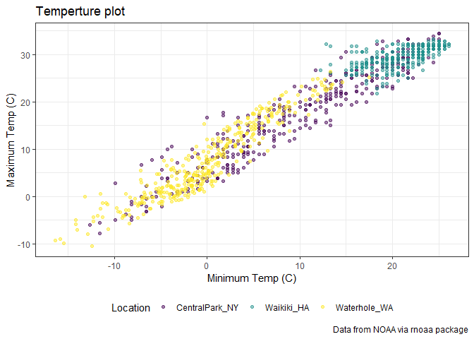<!-- -->

``` r
#If you want a minimal theme back drop, aka get rid of the black out line in grpah
ggp_base +
  theme_minimal ()+
  theme(legend.position = "bottom")
```

    ## Warning: Removed 15 rows containing missing values (geom_point).

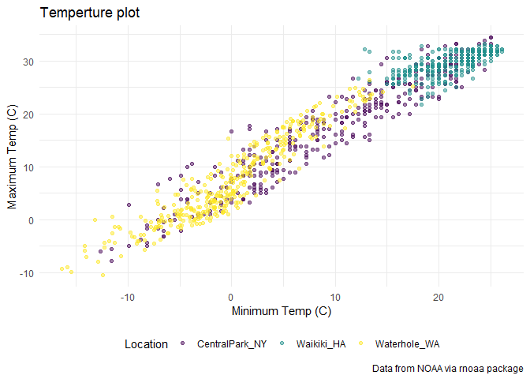<!-- -->

``` r
#theme minimal has to happen before them legened position, b/c theme minimal is applying a specfic lengend. Over arching themes go first aka like theme minimal, and any tweeks, like them lengend position go after. 
```

``` r
#If you want to drop the legend completely
ggp_base +
  theme_minimal ()+
  theme(legend.position = "none")
```

    ## Warning: Removed 15 rows containing missing values (geom_point).

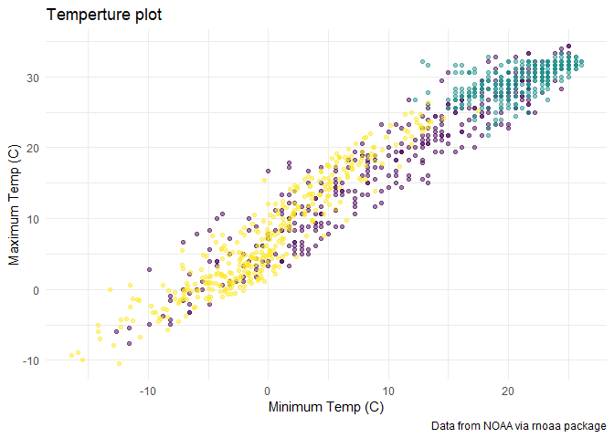<!-- -->

(where do my warnings come from)

``` r
weather_df %>% 
  filter(is.na(tmin))
```

    ## # A tibble: 15 x 6
    ##    name       id          date        prcp  tmax  tmin
    ##    <chr>      <chr>       <date>     <dbl> <dbl> <dbl>
    ##  1 Waikiki_HA USC00519397 2017-04-17     5  28.3    NA
    ##  2 Waikiki_HA USC00519397 2017-05-09    NA  NA      NA
    ##  3 Waikiki_HA USC00519397 2017-05-26    NA  NA      NA
    ##  4 Waikiki_HA USC00519397 2017-07-19    NA  NA      NA
    ##  5 Waikiki_HA USC00519397 2017-10-07     0  31.1    NA
    ##  6 Waikiki_HA USC00519397 2017-10-09     0  28.9    NA
    ##  7 Waikiki_HA USC00519397 2017-10-10    10  31.7    NA
    ##  8 Waikiki_HA USC00519397 2017-10-12     0  31.1    NA
    ##  9 Waikiki_HA USC00519397 2017-10-13     0  31.1    NA
    ## 10 Waikiki_HA USC00519397 2017-10-16     5  30      NA
    ## 11 Waikiki_HA USC00519397 2017-10-18     0  29.4    NA
    ## 12 Waikiki_HA USC00519397 2017-10-20    13  30.6    NA
    ## 13 Waikiki_HA USC00519397 2017-10-21     0  30      NA
    ## 14 Waikiki_HA USC00519397 2017-10-22     0  30      NA
    ## 15 Waikiki_HA USC00519397 2017-12-22     0  26.7    NA

## More than one data set

``` r
central_park =
  weather_df %>% 
  filter(name == "CentralPark_NY")

waikiki = 
  weather_df %>% 
  filter(name == "Waikiki_HA")

ggplot(data = waikiki, aes(x = date, y = tmax, color = name)) +
  geom_point(aes(size = prcp)) +
  geom_line(data = central_park)
```

    ## Warning: Removed 3 rows containing missing values (geom_point).

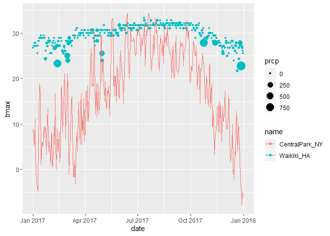<!-- -->

``` r
#we have a plot with just one data set and then stacked another data set into the original data set
```

(brief aside about colors)

``` r
# regular code
waikiki %>% 
  ggplot(aes(x=date, y =tmax, color= name))+
  geom_point()
```

    ## Warning: Removed 3 rows containing missing values (geom_point).

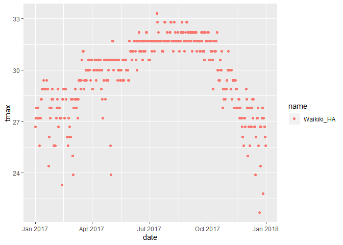<!-- -->

``` r
#code for assigning the data points a sepcific color, specify color in geomtery that takes this value
waikiki %>% 
  ggplot(aes(x=date, y =tmax))+
  geom_point(color = "blue")
```

    ## Warning: Removed 3 rows containing missing values (geom_point).

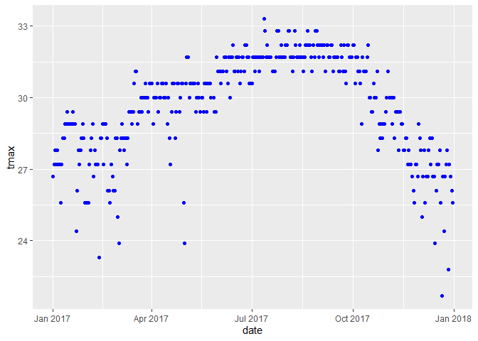<!-- -->

## Multi-panel plot

``` r
ggp_scatter =
  weather_df %>% 
  ggplot(aes(x = tmin, y = tmax))+
  geom_point()

ggp_density =
  weather_df %>% 
  ggplot(aes(x = tmin))+
  geom_density()

ggp_box = 
  weather_df %>% 
  ggplot(aes(x = name, y = tmax, color = name))+
  geom_boxplot()

ggp_scatter + ggp_density
```

    ## Warning: Removed 15 rows containing missing values (geom_point).

    ## Warning: Removed 15 rows containing non-finite values (stat_density).

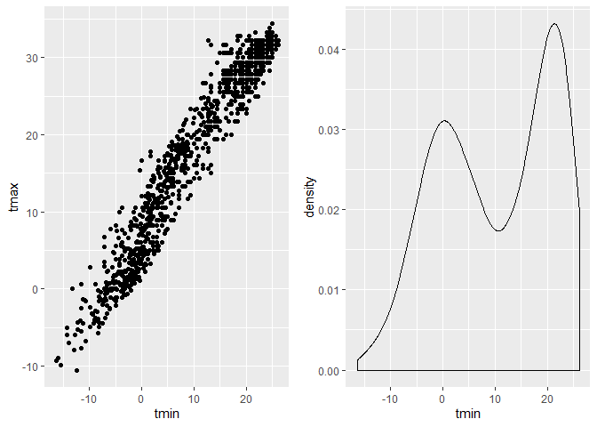<!-- -->

``` r
#This will make a scater plot next to density plus, add additional planel with + and put one on bottom using "/"

ggp_scatter + (ggp_density/ggp_box)
```

    ## Warning: Removed 15 rows containing missing values (geom_point).
    
    ## Warning: Removed 15 rows containing non-finite values (stat_density).

    ## Warning: Removed 3 rows containing non-finite values (stat_boxplot).

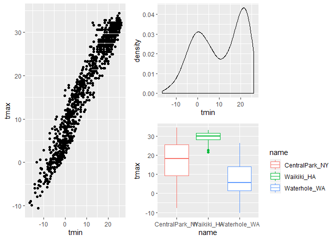<!-- -->

``` r
#not only way, can use grid arrange but teach doesnt like it
```

## Data Manipulation

``` r
ggp_box = 
  weather_df %>% 
  ggplot(aes(x = name, y = tmax, color = name))+
  geom_boxplot()
#change order of factors to change order of plt

weather_df %>% 
  mutate(
    name = factor(name),
    name = fct_relevel(name, "Waikiki_HA", "CentralPark_NY")) %>%
  ggplot(aes(x = name, y = tmax, color = name))+
  geom_boxplot()
```

    ## Warning: Removed 3 rows containing non-finite values (stat_boxplot).

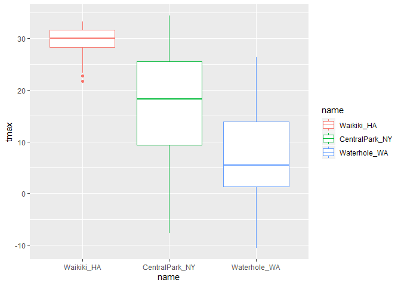<!-- -->

Reorder instead of rlevel

``` r
weather_df %>% 
  mutate(
    name = factor(name),
    name = fct_reorder(name, tmax)) %>%
  ggplot(aes(x = name, y = tmax, color = name)) +
  geom_boxplot()
```

    ## Warning: Removed 3 rows containing non-finite values (stat_boxplot).

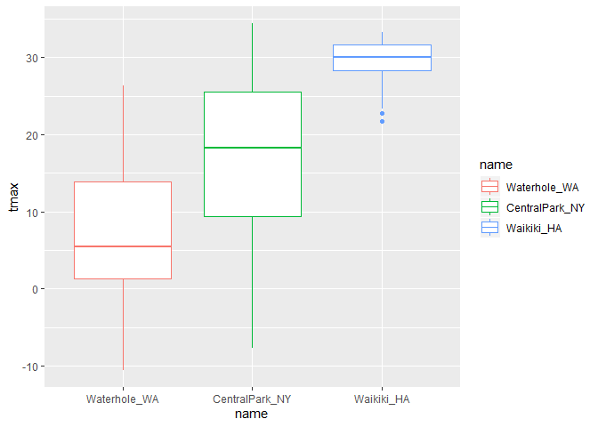<!-- -->

``` r
#Here we are reordering by tmax, lowest to highest t max
```

## Restructure then plot

``` r
#Plots for density of min temp of all locations and the max temp of all locations. 
weather_df %>% 
  pivot_longer(
    tmax:tmin,
    names_to = "observation",
    values_to = "temperture"
  ) %>% 
  ggplot(aes(x = temperture, fill = observation)) +
  geom_density(alpha = .5) +
  facet_grid(~name) +
  theme(legend.position = "bottom")
```

    ## Warning: Removed 18 rows containing non-finite values (stat_density).

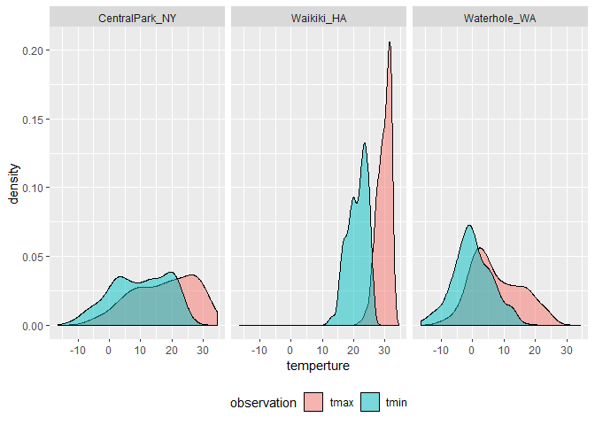<!-- -->

``` r
pulse_data = 
  haven::read_sas("./data/public_pulse_data.sas7bdat") %>%
  janitor::clean_names() %>%
  pivot_longer(
    bdi_score_bl:bdi_score_12m,
    names_to = "visit", 
    names_prefix = "bdi_score_",
    values_to = "bdi") %>%
  select(id, visit, everything()) %>%
  mutate(visit = recode(visit, "bl" = "00m"),
         visit = factor(visit, levels = str_c(c("00", "01", "06", "12"), "m"))) %>%
  arrange(id, visit)

ggplot(pulse_data, aes(x = visit, y = bdi)) + 
  geom_boxplot()
```

    ## Warning: Removed 879 rows containing non-finite values (stat_boxplot).

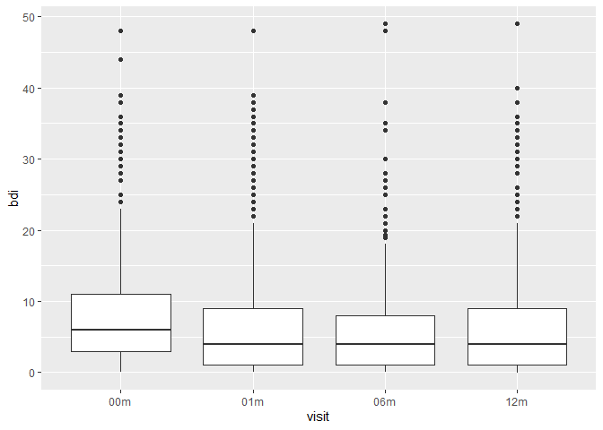<!-- -->

``` r
#factor is now going in alphabetical order, prior to tidying the data tideying makes this easier. 
```

litter and pups

``` r
pup_data = 
  read_csv("./data/FAS_pups.csv", col_types = "ciiiii") %>%
  janitor::clean_names() %>%
  mutate(sex = recode(sex, `1` = "male", `2` = "female")) 

litter_data = 
  read_csv("./data/FAS_litters.csv", col_types = "ccddiiii") %>%
  janitor::clean_names() %>%
  select(-pups_survive) %>%
  separate(group, into = c("dose", "day_of_tx"), sep = 3) %>%
  mutate(wt_gain = gd18_weight - gd0_weight,
         day_of_tx = as.numeric(day_of_tx))

fas_data = left_join(pup_data, litter_data, by = "litter_number") 


fas_data %>% 
  select(sex, dose, day_of_tx, pd_ears:pd_walk) %>% 
  pivot_longer(
    pd_ears:pd_walk,
    names_to = "outcome", 
    values_to = "pn_day") %>% 
  drop_na() %>% 
  mutate(outcome = forcats::fct_reorder(outcome, day_of_tx, median)) %>% 
  ggplot(aes(x = dose, y = pn_day)) + 
  geom_violin() + 
  facet_grid(day_of_tx ~ outcome)
```

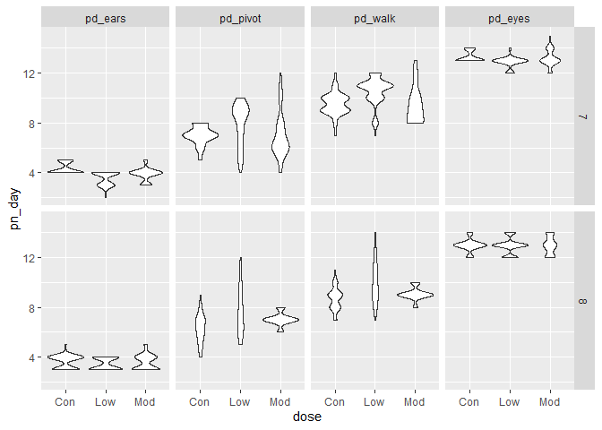<!-- -->
